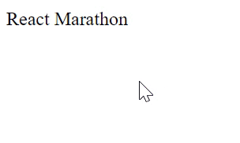

# React online marathon

## The task of the topic "Hooks"

There is the functional component `App` which renders one element `div` with text `React Marathon` in it

Using `hooks` write code to provide next functionality: if you click mouse on this `div` element text in it will be converted to lowercase

### Example

